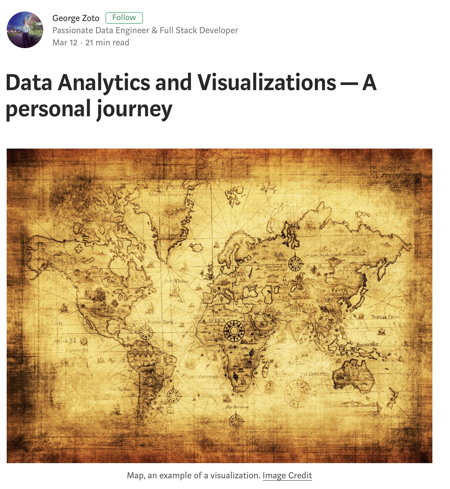

# Data Analytics and Visualizations - A personal journey  

A companion repository for my Medium article avaialble at: https://medium.com/datajournos/data-analytics-and-visualizations-a-personal-journey-b1a1318e24db

Over time we have seen several Business Intelligence tools emerge, some of them promising to take our analysis to the next level, while others assist us with developing stunning visualizations that tell a compelling story. Discovering such stories behind massive datasets is my day to day job at a local non-profit that is dedicated to end childhood hunger. I thought I would share my journey and comparison criteria with you when evaluating a modern Business Intelligence tool. Please keep in mind that this analysis is completely subjective and based on my previous experience. Before we dive right in, let me give you some more context on my background and how I approached the task of evaluating several such tools, not so long ago.

**Table of Content:**  
* My experience in the field of data analytics and visualizations  
* What do I look for in a modern Business Intelligence Tool  
* I. Cleaning and Data Organization  
* II. Cost  
* III. Market Segment, Product Reviews and Online Presence  
* IV. 0 to 60  
* V. Interactivity, APIs and Accountability  
* VI. Open-source vs Proprietary, Release Cycle, Support and Community  
* VII. Data Collection and Data Resiliency  
* VIII. Data Storage and Data Wrangling  
* IX. Data Analysis, Enrichment and Join  
* X. Data Visualization and Storytelling  
* XI. Data Sharing  
* XII. Security and Data Governance  
* Conclusion and Survey  

**My experience in the field of data analytics and visualizations**  
Education wise, I have a B.S. in Computer Engineering and Telecommunications and a M.S in Electrical Engineering. Before graduating back in 2012, my favorite and awesome Business Intelligence tool was Matlab. For many of you out there who do not know Matlab, think of it as a scientific workbench.

Matlab requires you to learn its syntax, but I really like the fact that “out of the box” you could:
1. Import your own data.
2. Perform analysis on it.
3. Visualize your findings and share them with the world, or in most cases your colleagues or your class professor.

If you think that sounds great, it gets better. The tool allows you to share your work with others or import their work in your environment as well as access literally hundreds of packages and tutorials from math and physics to control systems and biology. It’s not a coincidence that it is still the most popular tool in academia, at least in the STEM field.

In my first job as a System’s Engineer in a leading satellite communications company, I quickly saw the benefits of using a tool that in a few words, would allow us to:
1. Gather performance related data from many of the components that made all the magic happen and allowed a user from any place in the world to reach any other person or the Internet.
2. Analyze such data against our own performance benchmarks.
3. Identify outliers or patterns, especially when multiple users were using the system simultaneously.
4. Alert us on such patterns, if possible real-time.
5. Generate for us daily and weekly reports so we can allocate our resources in an optimum way over time and forecast for us our needs, in terms of resources, in the long-term future.

As much as I really liked Matlab, clearly it was not the right tool for the job. With that said, our company in general and not just me, had been developing their own tools that would accomplish as many items from this list as possible and in other cases purchased production level tools that would get the job done. Needless to say, both the in-house and purchased solutions needed to talk to each other and be able to exchange information when needed.

My team and I also wrote such tools mainly in Python and Java and utilizing open-source technologies and libraries such as Django, Pandas, Scikit, MongoDB, Fusioncharts, Hicharts, D3 and so on. I also designed and developed a feature that combined the easiness of asking human friendly questions with getting answers instantly in various formats such as graphs, timelines, dashboards or interactive queries. Making these tools even more accessible to users, I developed a popularity or community pulse feature where all users would see which topics, issues or searches were the most popular in the recent past and be able to ask the same question with the click of a button. Towards the end, I also started exploring machine learning. I was working towards integrating forecasting in one of our custom solutions, as well as towards generating weekly articles from the underlying data using natural language processing, coming one step closer to automated storytelling. In the end of a couple of months of hard work, we had our own custom Business Intelligence tools that fulfilled 99% of the criteria and tasks we originally aimed for. For every new feature needed, we simply had to develop, test and deploy it in production ourselves. Note, this was before modern Business Intelligence tools were popular or affordable so we didn’t really have any other choice. Even the ones that were present, Tableau being an example, didn’t satisfy more than 30% to 40% of our needs.

By the end of this beautiful journey in my previous company, new players had made their appearance such as Splunk, Hadoop and its rich ecosystem around Big Data, AWS, Tableau, Artificial Intelligence, IBM Watson and this new platform called Elasticsearch. Educating myself on many such platforms, with the help of Coursera, Udemy and Udacity and attending several meetups in the area, I started exploring the capabilities that such tools and platforms had to offer. I wanted to explore their kept and unkept promises as well as the teams behind them, their vision for their products and the communities around them. The next part of this article will hopefully shed some light in what do I look for in a modern Business Intelligence tool, as well as what did I have in mind while I was building my own custom tools.

**What do I look for in a modern Business Intelligence Tool**  
A research article published in Forbes back in 2016 found that 80% of the time data scientists spend is actually spent in collecting, cleaning and organizing our datasets. This is almost the equivalent of working on a project for five days, just to get the chance to analyze it and draw your conclusion on the weekend. I am not sure about you, but that seems like a lot of time.

Here are the twelve most important criteria I consider when evaluating a modern Business Intelligence tool. Criteria two to six orbit around the quality of the final product while criteria one and seven to twelve, focus on the technical side of a tool.

**I. Cleaning and Data Organization**  
An ideal tool should be able to recognize a structured dataset in a well defined format. A comma separated values (csv) format or web access logs are such good examples. In case where the underlying data is semi-structured and follows its own format, an option to parse it and extract only the relevant fields is a must-have feature for a modern tool. Finally, in the case of raw unstructured data or data in non-machine friendly format (pdf files for example, heavily nested headers and rows in a table or just raw numbers and text), there isn’t much any current tool can do. I see some great interest in using machine learning in discovering patterns and underlying data types in such cases, but from my experience, this is mostly a work in progress or a research topic thus far.

An important factor here is Data Quality. Tim Berners-Lee, the inventor of the Web and Linked Data initiator, suggested a 5-star deployment scheme for Open Data, where based on format and structure, different datasets are awarded a score based on how accessible and readable they are. Going from one star and progressing to five, a datasource author is not only providing raw data but also structure, non-proprietary open formats and sharable context. In many cases, this data quality can make or break data analysis in modern Business Intelligence tools.

**II. Cost**  
Like everything in life, all these great features and hard work come at a cost. It is important to make a budget analysis and think of two main directions:
1. The cost of the tool taking into account all the features it offers as well as the number of users that can use it over a long period of time. Many tools offer an upfront charge for a license per user or per installation, while others offer a subscription model per user, per month. It is good to think about scalability at this point and try to forecast how this number would change if your organization went from a 10% adoption rate to a 50% rate or later on to a 100% adoption rate.
2. The cost of having data silos and not being able to integrate all of your organization’s data sources on a common platform that would allow you to look at the bigger picture hiding behind your data. Unfortunately, in today’s world, this is not that uncommon, with each data management solution having its own language or format and not being able to “talk” to one another.

**III. Market Segment, Product Reviews and Online Presence**  
This is the case for almost every decision we make online. This is why the marketing field will always be a popular one in my opinion. Having great real cases, positive reviews and success stories is imperative for a modern platform. I try my best for my work to speak for itself, so I won’t have to say a word. This is why an instant surprise or impression on the capabilities of a tool is highly desirable.

It is also important to try and figure out where does each platform you are evaluating fit into the bigger picture. Is it geared more towards personal use? Can it handle high volume or scale of data? What about a wide variety of data? How about velocity or speed of data being generated? Can it assist you with validating any of the incoming datasets against others or reducing any noise or bias in your data (veracity of data)? Finally, is this platform production ready, battle proven and used by modern startups or larger companies? Does it allow you to setup your own data engineering and orchestration environment and does it allow you to do any performance tuning based on your specific use cases and scenarios ?
I guess the other side of the coin here is, do you and your organization really know what you need and therefore what to really look for?

**IV. 0 to 60**  
Zero to sixty literally means how easy and fast you can go from holding a dataset in your computer or available somewhere online, import it to a Business Intelligence tool, analyze it and create a simple visualization from it. Think of Microsoft Excel for example and how easy it is for someone to just open a CSV file, create a pivot table and visualize your findings in a few clicks. Personally, I have seen several tools that are experts in this topic and other ones that take a few extra steps to get to the finish line. If your day to day activities are around simple tasks with minimal or no development time at all, then obviously you would need to steer your attention in this direction. With several tools offering a trial period of exploring their main features, you should be able to get a basic understanding of where they score in this criterion.

**V. Interactivity, APIs and Accountability**  
Looking at modern Business Intelligence tools over time, I have noticed a movement towards user interactivity and user engagement. As a daily user of such a product you would perhaps prefer one that allows you to easily interact with it, keep the simple tasks simple and even customize parts of it to better fit your data exploration preferences. It would be ideal if a modern tool actually did some of the trivial tasks for you or at least recommend an initial analysis or data wrangling so you don’t have to start from scratch with every new dataset you explore. Personally, I have come across tools that actually allow you to ask your own questions in a simple language and let it identify the underlying task of performing the right analysis and present the results back to the user. I have also come across tools that based on a well known or well formatted dataset, perform an initial analysis for you and create live, interactive, dashboards automatically with zero involvement on your part.

Similar to user interaction, another criterion that is important today is the notion of “APIs as first citizens” or the ability for a modern tool to “speak” the modern machine-friendly language behind an Application Programming Interface. Think of it as the alphabet for a modern tool, without such a feature it cannot communicate or exchange information with any other tool or datasource out there. If you support it natively, a whole new world is open for exploration, as long as security in always kept in mind.

