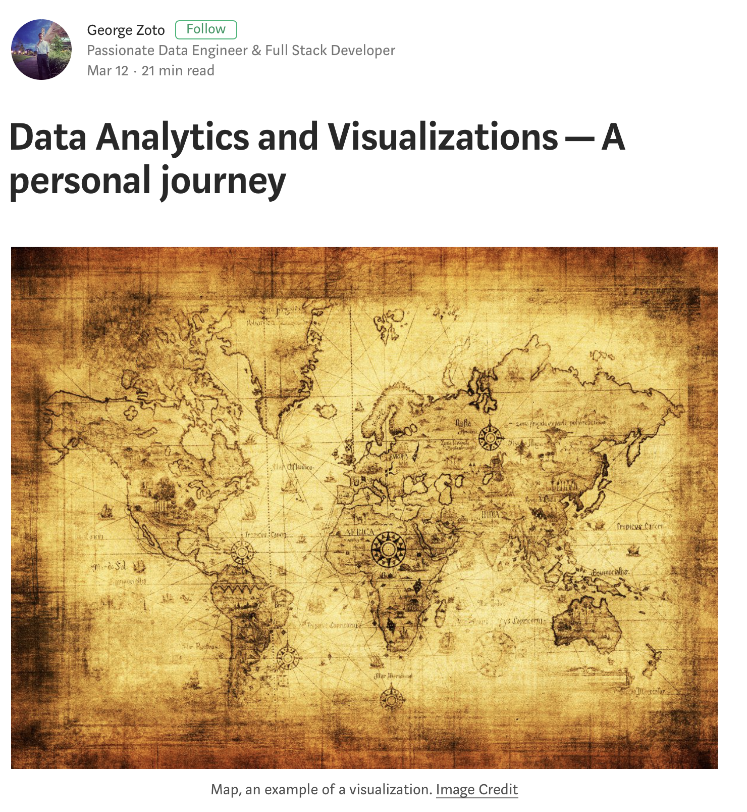

# Publications

A companion list of repositories for my published articles as well several Certifications I have accomplished.

**Data Analytics and Visualizations - A personal journey**  
* A fascinating story around big data, data analytics and data visualization published on Medium   
* https://medium.com/@georgezoto/data-analytics-and-visualizations-a-personal-journey-b1a1318e24db  

**Estimation of Average Vehicle Speeds Traveling on Heterogeneous Lanes Using Bluetooth Sensors**  
* IEEE Vehicular Technology Conference  
* https://ieeexplore.ieee.org/document/6399146     

